# Build instructions
Please read the [notes](notes.md) if you have not already done so.

### Bill of material
[Main board](bom/BOM_mainboard_nordhat.csv)

[Expansion board](bom/BOM_expansion_board_nordhat.csv)

#### 1) SMD components
Start by soldering the SMD components on both boards. Clean up with IPA if necessary.

#### 2) Through-hole components

Solder the buttons, the encoders, the expansion header and the UART header.

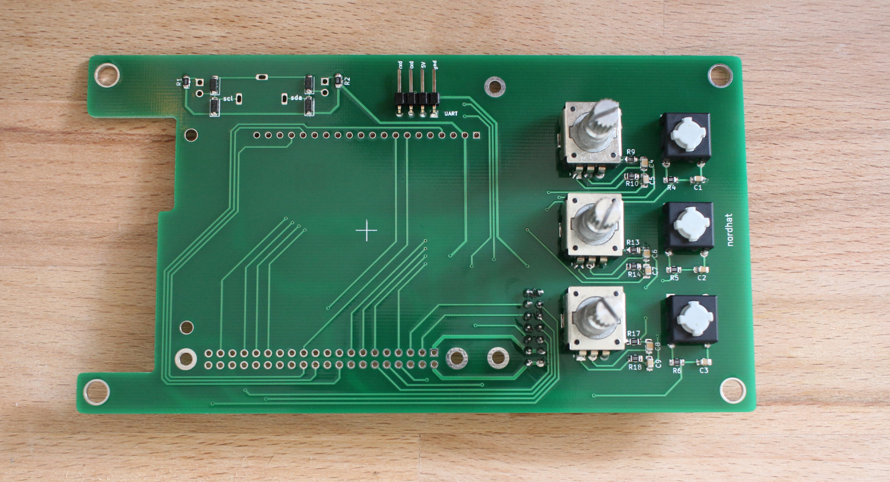
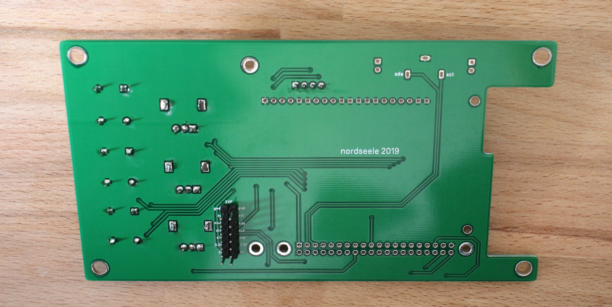

On the expansion board, make sure all the jack connectors are properly aligned. The pads have been voluntarily enlarged.  

Mount the HEX standoffs on the Raspberry Pi, put the header on, make sure everything is aligned and solder the J1 header to the main board. Use 3 11mm MF standoffs or 2 FF and 1 MF and a M2.5 nut for H9 (h9 is under the display but it remains accessible once the OLED is soldered on.) See photo n°9

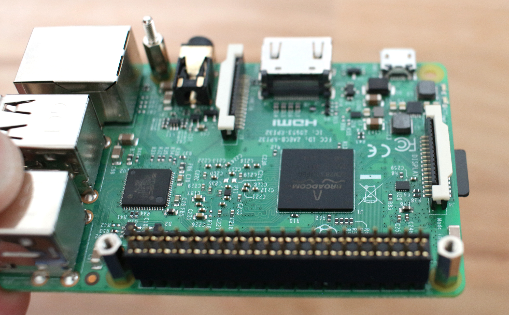
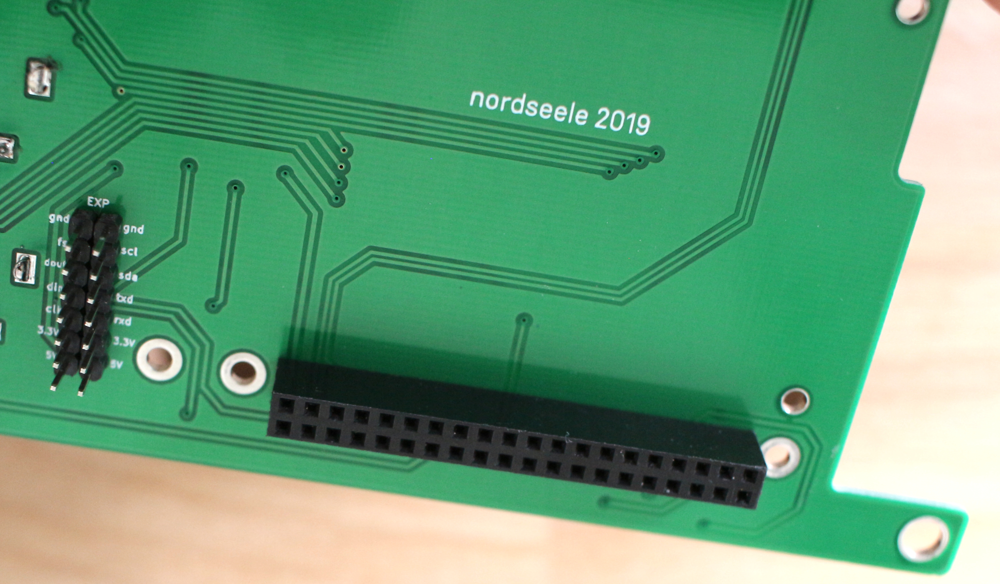

Detach the Raspberry Pi and solder the OLED display. Be careful with the alignement. It will be quite difficult to reposition or desolder afterwards.

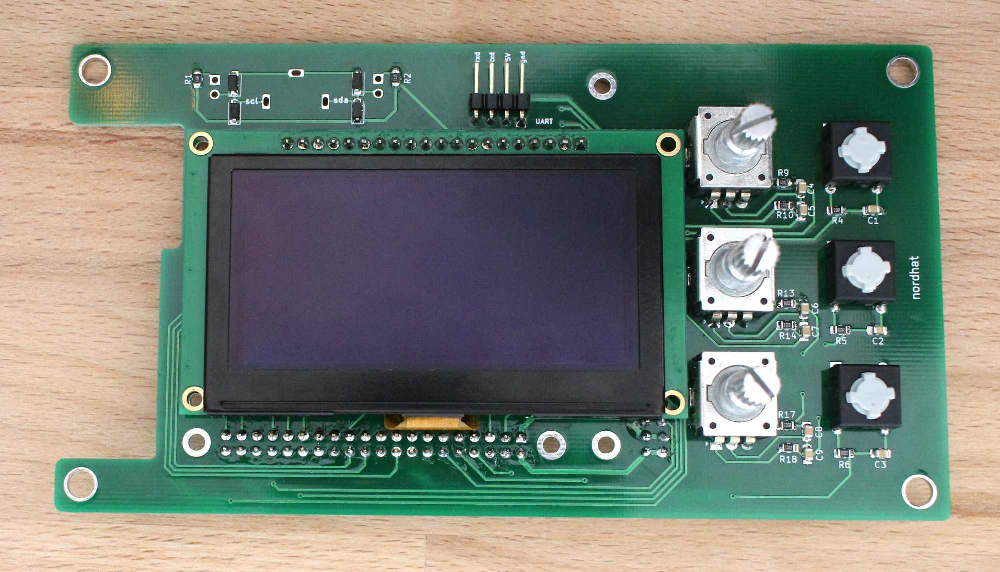
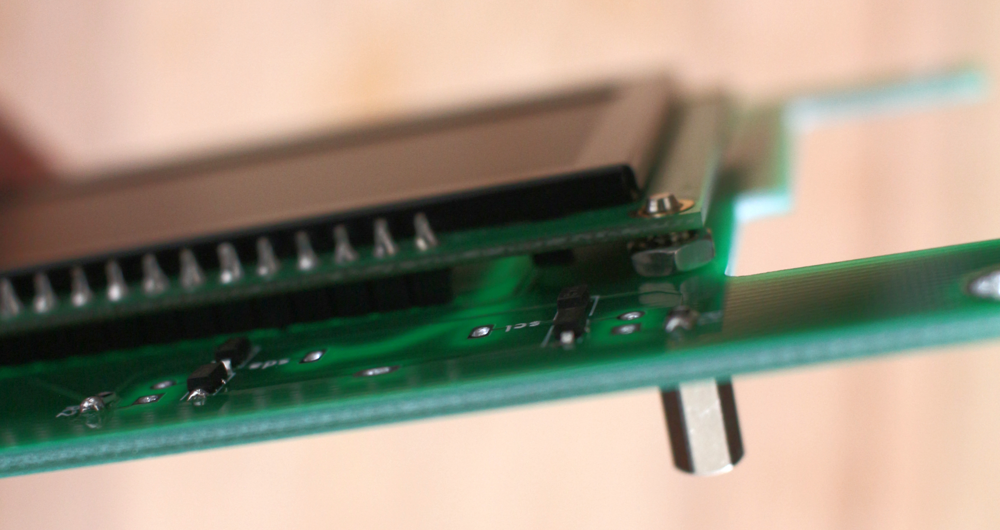

You can now attach the Raspberry Pi to the main board using M2.5 screws.

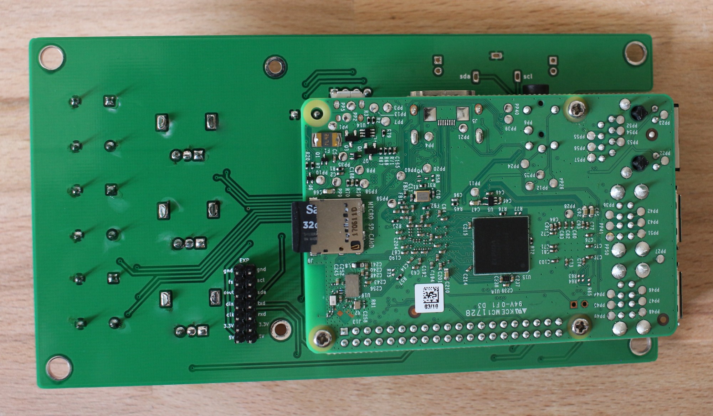

## Assembling the two boards

Mount the two boards and the panels together using the standoffs and the screws. You'll need the attach the 7mm and the 10mm standoffs together using headless M3 screws.

| holes (h) | position | length  | type  | thread | quantity | sku
| :---: | :---: |:-------: | :-----: | :------: | :--------: | :----:
| 1, 2, 3, 4 | A | 7mm   | FF  | M3 | 4 | WA-SMSI 9774070360R
| 1, 3 | D  | 15mm   |  FF | M3  | 2 | WA-SMSI 9774150360R
| 5, 6  | RPI | 11mm  | FF  | M2.5 | 2 | use hex
| 9   | RPI | 11mm  | MF  | M2.5 | 1 | use hex
| 8, 7   | EXP | 10mm  | FF  | M2.5 | 2 | use hex
| 2, 4 | C | 3mm   |  FF | M3  | 2 | WA-SMSI 9774030360R
| 2, 4 | B | 10mm |  FF | M3  | 2 | WA-SMSI 9774100360R

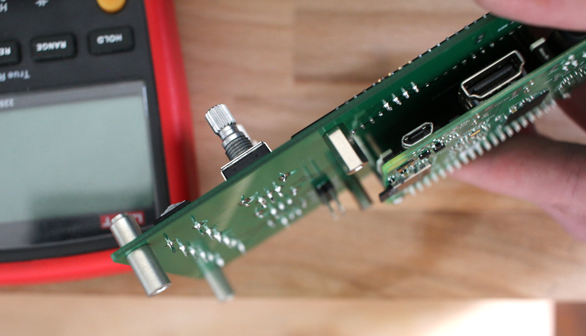
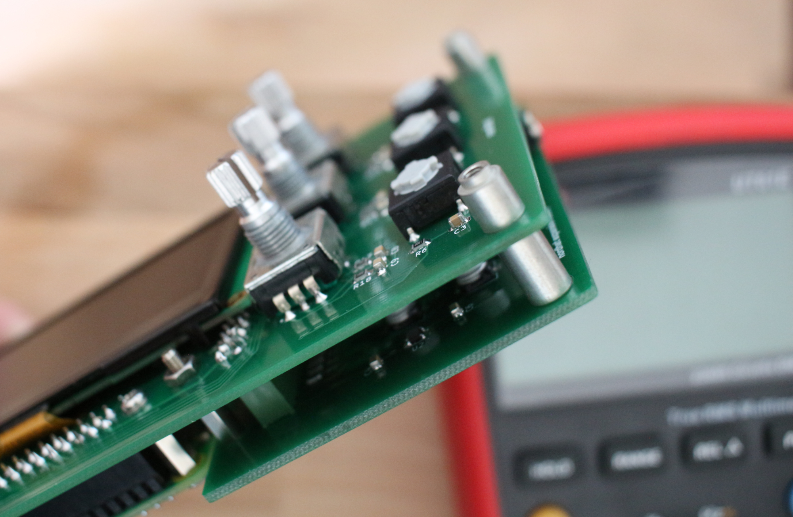
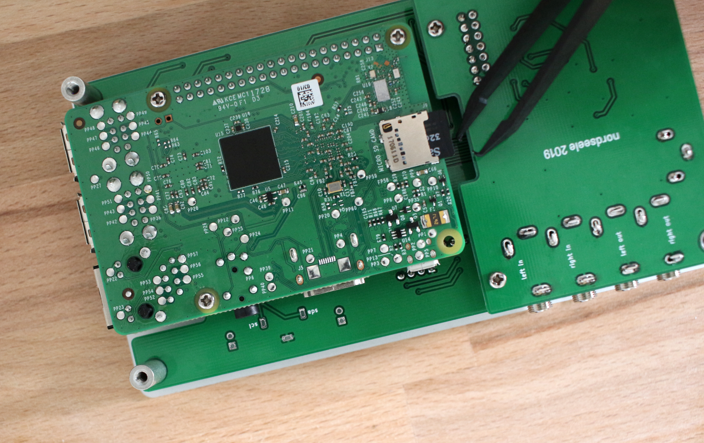

Don't forget to insert the SD card. You can still access it afterwards without detaching the exp board and the RPI but you'll need to detach the bottom panel.

You might attach the 3mm standoffs to the bottom panel, it's easier like that.

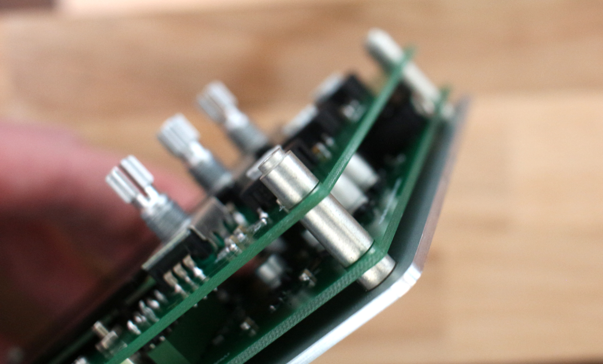

"Flush cut"" the legs of the jack connectors so they don't accidentally enter in contact with the bottom panel. You might have to do the same with the legs of the butonns on main board.

Secure the exp board to the main board (h8, h78) and assemble the bottom panel.

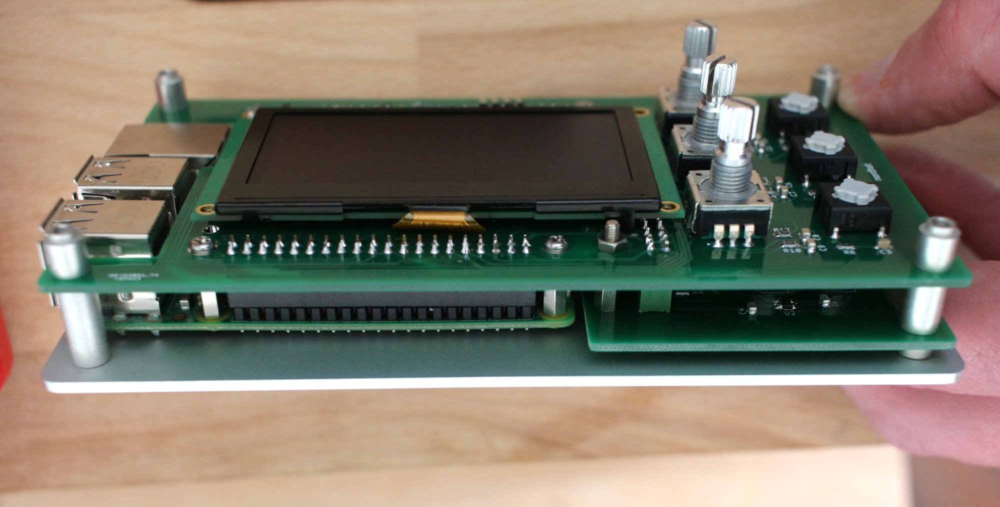

Place the screen protection under the top panel using double side adhesive tape.

Attach the top panel and place the button caps on the buttons.

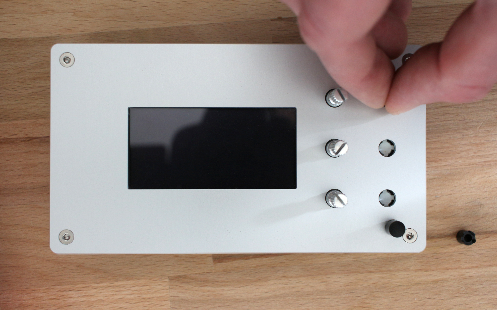
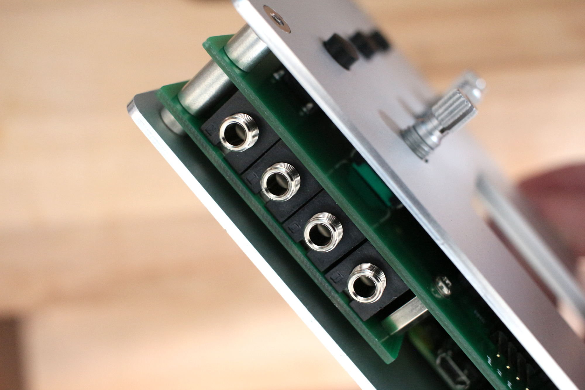
